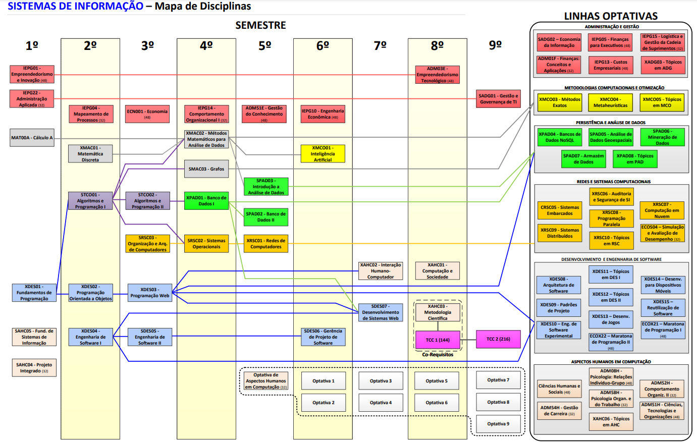
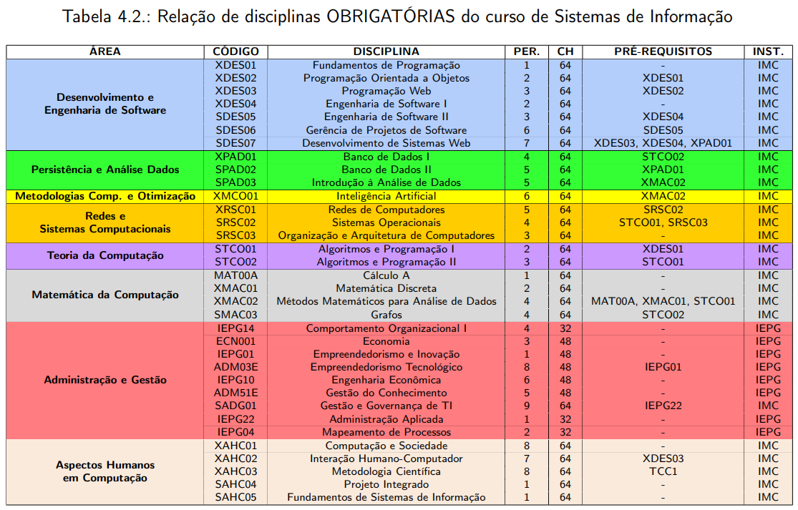
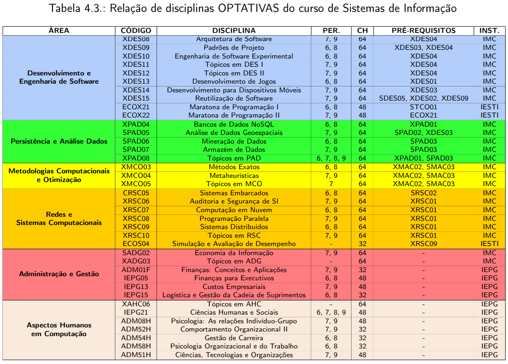
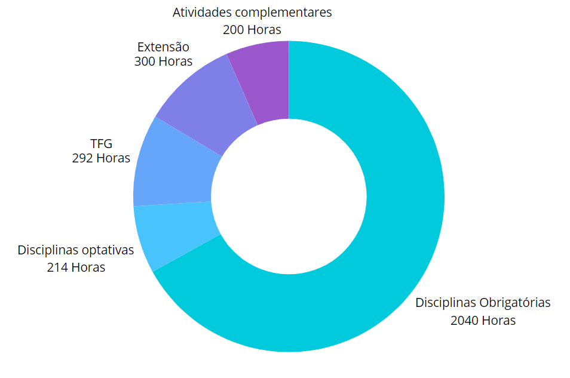

# Grade Curricular do Curso de Sistemas de Informação - UNIFEI

## Introdução
O curso de Sistemas de Informação da Universidade Federal de Itajubá (UNIFEI) tem como objetivo formar profissionais capacitados para atuar na área de tecnologia da informação, desenvolvendo e gerenciando sistemas de informação que atendam às necessidades das organizações modernas.

## Estrutura Curricular

## Disciplinas Obrigatórias

| Área                                   | Código  | Disciplina                                  | Períodos | CH | Pré-requisitos                        | Instituto |
|----------------------------------------|---------|---------------------------------------------|----------|----|---------------------------------------|-----------|
| Desenvolvimento e Engenharia de Software | XDES01  | Fundamentos de Programação                    | 1        | 64 | -                                 | IMC       |
| Desenvolvimento e Engenharia de Software | XDES02  | Programação Orientada a Objetos               | 2        | 64 | XDES01                            | IMC       |
| Desenvolvimento e Engenharia de Software | XDES03  | Programação Web                               | 3        | 64 | XDES02                            | IMC       |
| Desenvolvimento e Engenharia de Software | XDES04  | Engenharia de Software I                      | 2        | 64 | -                                 | IMC       |
| Desenvolvimento e Engenharia de Software | SDES05  | Engenharia de Software II                     | 3        | 64 | XDES04                            | IMC       |
| Desenvolvimento e Engenharia de Software | SDES06  | Gerência de Projetos de Software              | 6        | 64 | SDES05                            | IMC       |
| Desenvolvimento e Engenharia de Software | SDES07  | Desenvolvimento de Sistemas Web               | 7        | 64 | XDES03, XDES04, XPAD01            | IMC       |
| Persistência e Análise de Dados        | XPAD01  | Banco de Dados I                              | 4        | 64 | STC002                            | IMC       |
| Persistência e Análise de Dados        | SPAD02  | Banco de Dados II                             | 5        | 64 | XPAD01                            | IMC       |
| Persistência e Análise de Dados        | SPAD03  | Introdução à Análise de Dados                 | 5        | 64 | XMAC02                            | IMC       |
| Metodologias Computacionais e Otimização | XMC001  | Inteligência Artificial                       | 6        | 64 | XMAC02                            | IMC       |
| Redes e Sistemas Computacionais        | XRSC01  | Redes de Computadores                         | 4        | 64 | SRSC02                            | IMC       |
| Redes e Sistemas Computacionais        | SRSC02  | Sistemas Operacionais                         | 5        | 64 | STC001, SRSC03                    | IMC       |
| Redes e Sistemas Computacionais        | SRSC03  | Organização e Arquitetura de Computadores     | 3        | 64 | -                                 | IMC       |
| Teoria da Computação                   | STC001  | Algoritmos e Programação I                    | 2        | 64 | XDES01                            | IMC       |
| Teoria da Computação                   | STC002  | Algoritmos e Programação II                   | 3        | 64 | STC001                            | IMC       |
| Matemática da Computação               | MAT00A  | Cálculo A                                     | 1        | 64 | -                                 | IMC       |
| Matemática da Computação               | XMAC01  | Matemática Discreta                           | 2        | 64 | -                                 | IMC       |
| Matemática da Computação               | XMAC02  | Métodos Matemáticos para Análise de Dados     | 4        | 64 | MAT00A, XMAC01, STC001            | IMC       |
| Matemática da Computação               | SMAC03  | Grafos                                        | 4        | 64 | STC002                            | IMC       |
| Administração e Gestão                 | IEPG14  | Comportamento Organizacional I                | 4        | 32 | -                                 | IEPG      |
| Administração e Gestão                 | ECN001  | Economia da Informação                        | 3        | 48 | -                                 | IEPG      |
| Administração e Gestão                 | IEPG01  | Empreendedorismo e Inovação                   | 1        | 48 | -                                 | IEPG      |
| Administração e Gestão                 | ADM03E  | Empreendedorismo Tecnológico                  | 4        | 48 | IEPG01                            | IEPG      |
| Administração e Gestão                 | IEPG10  | Engenharia Econômica                          | 6        | 48 | -                                 | IEPG      |
| Administração e Gestão                 | ADM51E  | Gestão do Conhecimento                        | 5        | 48 | -                                 | IEPG      |
| Administração e Gestão                 | SADG01  | Gestão e Governança de TI                     | 7        | 64 | IEPG22                            | IMC       |
| Administração e Gestão                 | IEPG22  | Administração Aplicada                        | 1        | 32 | -                                 | IEPG      |
| Administração e Gestão                 | IEPG04  | Mapeamento de Processos                       | 2        | 32 | -                                 | IEPG      |
| Aspectos Humanos em Computação        | XAHC01  | Computação e Sociedade                        | 8        | 64 | -                                 | IMC       |
| Aspectos Humanos em Computação        | XAHC02  | Interação Humano-Computador                   | 7        | 64 | XDES03                            | IMC       |
| Aspectos Humanos em Computação        | XAHC03  | Metodologia Científica                        | 6        | 32 | TCC1                              | IMC       |
| Aspectos Humanos em Computação        | SAHC04  | Projeto Integrado                             | 8        | 64 | -                                 | IMC       |
| Aspectos Humanos em Computação        | SAHC05  | Fundamentos de Sistemas de Informação         | 1        | 64 | -                                 | IMC       |

## Disciplinas Optativas

| Área                                   | Código  | Disciplina                                  | Períodos | CH | Pré-requisitos                        | Instituto |
|----------------------------------------|---------|---------------------------------------------|----------|----|---------------------------------------|-----------|
| Desenvolvimento e Engenharia de Software | XDES08  | Arquitetura de Software                     | 7, 8, 9  | 64 | XDES04                                | IMC       |
| Desenvolvimento e Engenharia de Software | XDES09  | Padrões de Projeto                          | 7, 8, 9  | 64 | XDES04                                | IMC       |
| Desenvolvimento e Engenharia de Software | XDES10  | Engenharia de Software Experimental         | 6, 8     | 64 | XDES04                                | IMC       |
| Desenvolvimento e Engenharia de Software | XDES11  | Tópicos em DES I                            | 7, 8, 9  | 64 | XDES04                                | IMC       |
| Desenvolvimento e Engenharia de Software | XDES12  | Tópicos em DES II                           | 7, 8, 9  | 64 | XDES04                                | IMC       |
| Desenvolvimento e Engenharia de Software | XDES13  | Desenvolvimento de Jogos                    | 7, 8, 9  | 64 | XDES01                                | IMC       |
| Desenvolvimento e Engenharia de Software | XDES14  | Desenvolvimento para Dispositivos Móveis    | 7, 8, 9  | 64 | XDES03                                | IMC       |
| Desenvolvimento e Engenharia de Software | XDES15  | Reutilização de Software                    | 7, 8, 9  | 64 | SDES05, XDES02, XDES09                | IMC       |
| Desenvolvimento e Engenharia de Software | ECOX21  | Maratona de Programação I                   | 7, 9     | 48 | STC001                                | IESTI     |
| Desenvolvimento e Engenharia de Software | ECOX22  | Maratona de Programação II                  | 7, 9     | 48 | ECOX21                                | IESTI     |
| Persistência e Análise de Dados        | XPAD04  | Bancos de Dados NoSQL                       | 6, 8     | 64 | XPAD01                                | IMC       |
| Persistência e Análise de Dados        | SPAD05  | Análise de Dados Geoespaciais               | 7, 9     | 64 | SPAD02, XDES03                        | IMC       |
| Persistência e Análise de Dados        | SPAD06  | Mineração de Dados                          | 7, 9     | 64 | SPAD03                                | IMC       |
| Persistência e Análise de Dados        | SPAD07  | Armazenagem de Dados                        | 7, 9     | 64 | SPAD03                                | IMC       |
| Persistência e Análise de Dados        | XPAD08  | Tópicos em PAD                              | 6, 7, 8, 9 | 64 | XPAD01, SPAD03                       | IMC       |
| Metodologias Computacionais e Otimização | XMC003  | Métodos Exatos                              | 6, 8     | 64 | XMAC02, SMAC03                        | IMC       |
| Metodologias Computacionais e Otimização | XMC004  | Metaheurísticas                             | 7, 9     | 64 | XMAC02, SMAC03                        | IMC       |
| Metodologias Computacionais e Otimização | XMC005  | Tópicos em MCO                              | 7, 9     | 64 | XMAC02, SMAC03                        | IMC       |
| Redes e Sistemas Computacionais        | CRSC05  | Sistemas Embarcados                         | 6, 8     | 64 | SRSC02                                | IMC       |
| Redes e Sistemas Computacionais        | XRSC06  | Auditoria e Segurança de SI                 | 7, 9     | 64 | XRSC01                                | IMC       |
| Redes e Sistemas Computacionais        | XRSC07  | Computação em Nuvem                         | 6, 8     | 64 | XRSC01                                | IMC       |
| Redes e Sistemas Computacionais        | XRSC08  | Programação Paralela                        | 7, 9     | 64 | XRSC01                                | IMC       |
| Redes e Sistemas Computacionais        | XRSC09  | Sistemas Distribuídos                       | 7, 9     | 64 | XRSC01                                | IMC       |
| Redes e Sistemas Computacionais        | XRSC10  | Tópicos em RSC                              | 7, 9     | 64 | XRSC01                                | IMC       |
| Redes e Sistemas Computacionais        | ECOS04  | Simulação e Avaliação de Desempenho         | -        | 32 | XRSC09                                | IESTI     |
| Administração e Gestão                 | SADG02  | Economia da Informação                      | 7, 9     | 64 | -                                   | IMC       |
| Administração e Gestão                 | XADG03  | Tópicos em ADG                              | -        | 64 | -                                   | IMC       |
| Administração e Gestão                 | ADM01F  | Finanças: Conceitos e Aplicações            | 7, 9     | 32 | -                                   | IEPG      |
| Administração e Gestão                 | IEPG05  | Finanças para Executivos                    | 6, 8     | 48 | -                                   | IEPG      |
| Administração e Gestão                 | IEPG13  | Custos Empresariais                         | 6, 8     | 48 | -                                   | IEPG      |
| Administração e Gestão                 | IEPG15  | Logística e Gestão da Cadeia de Suprimentos | 6, 8     | 32 | -                                   | IEPG      |
| Aspectos Humanos em Computação        | XAHC06  | Tópicos em AHC                              | 6, 7, 8, 9 | 64 | -                                   | IEPG      |
| Aspectos Humanos em Computação        | IEPG21  | Ciências Humanas e Sociais                  | 6, 7, 8, 9 | 48 | -                                   | IEPG      |
| Aspectos Humanos em Computação        | ADM08H  | Psicologia: As relações Indivíduo-Grupo     | 7, 9     | 48 | -                                   | IEPG      |
| Aspectos Humanos em Computação        | ADM52H  | Comportamento Organizacional II             | 6, 8     | 32 | -                                   | IEPG      |
| Aspectos Humanos em Computação        | ADM54H  | Gestão de Carreira                          | 6, 8     | 48 | -                                   | IEPG      |
| Aspectos Humanos em Computação        | ADM58H  | Psicologia Organizacional e do Trabalho     | 7, 9     | 32 | -                                   | IEPG      |
| Aspectos Humanos em Computação        | ADM51H  | Ciências, Tecnologias e Organizações        | 7, 9     | 64 | -                                   | IEPG      |

### Trabalho Final de Graduação
O Trabalho Final de Graduação (TFG) consiste em um projeto onde o aluno aplica os conhecimentos adquiridos ao longo do curso para desenvolver uma solução real para um problema específico. O TFG possui uma carga horária de 350 horas.

### Atividades Complementares
Os alunos devem cumprir 200 horas de atividades complementares, que podem incluir cursos, palestras, projetos de extensão, entre outras atividades que contribuam para a formação profissional.

# Trilha de Formação
O curso de Sistemas de Informação da UNIFEI é estruturado em diversas trilhas de formação, permitindo especializações específicas. As trilhas incluem:

###  Trilha de Desenvolvimento de Sistemas:

Foco: Programação, engenharia de software e banco de dados.
Disciplinas: Fundamentos de Programação, Programação Orientada a Objetos, Engenharia de Software I e II.

### Trilha de Infraestrutura e Redes:

Foco: Redes de computadores, sistemas operacionais e administração de sistemas.
Disciplinas: Redes de Computadores, Sistemas Operacionais, Administração e Gerência de Redes.

### Trilha de Gestão e Empreendedorismo:

Foco: Administração, contabilidade, empreendedorismo e governança de TI.
Disciplinas: Introdução à Administração, Contabilidade em Informática, Empreendedorismo em Informática, Governança em TI.

### Trilha de Inteligência de Negócios e Sistemas Inteligentes:

Foco: Data mining, sistemas de apoio à decisão e inteligência artificial.
Disciplinas: Sistemas Inteligentes, Mineração de Dados, Inteligência de Negócios, Auditoria e Segurança de Sistemas de Informação.
Cada trilha é projetada para fornecer conhecimentos específicos e avançados, preparando os alunos para diversas áreas da tecnologia da informação.

## Gráficos de Carga Horária

