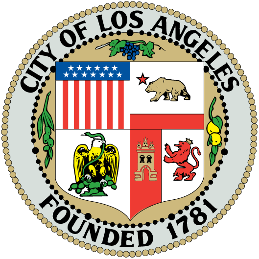
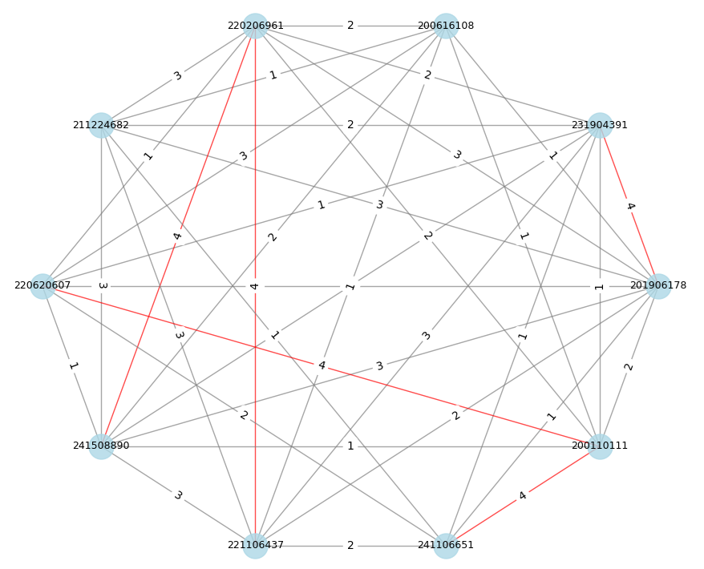
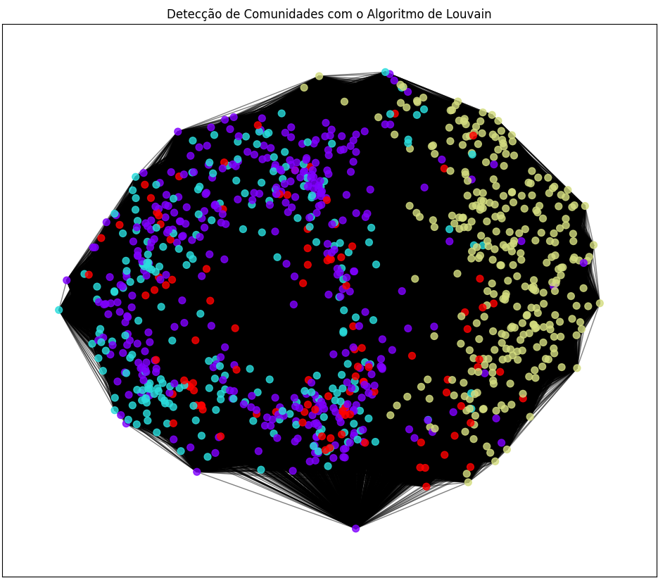
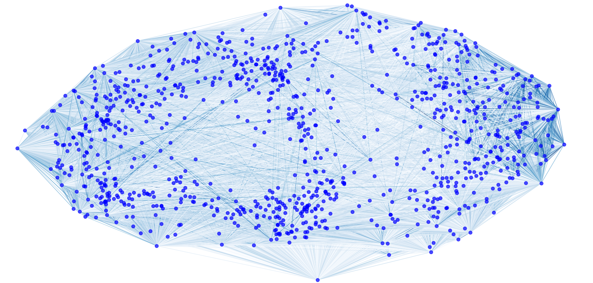

# Análise Criminal e Teoria dos Grafos - SMAC03

    
    
    

## 🎯 Objetivo

Los Angeles enfrenta altos índices de criminalidade, o que gera desafios significativos para a segurança pública, especialmente com os Jogos Olímpicos de 2028 se aproximando. Este projeto utiliza conceitos de Teoria dos Grafos para modelar e analisar dados criminais, buscando padrões e interações entre crimes, localizações e atributos temporais. A análise tem como objetivo auxiliar na tomada de decisões e no planejamento de medidas preventivas.

## 📋 Requisitos Técnicos

- Modelagem de dados criminais em um grafo.
- Aplicação de algoritmos de detecção de comunidades, como Louvain.
- Visualização de resultados por meio de imagens e gráficos.
- Versionamento e documentação.

## 💻 Tecnologias Utilizadas

- Python
- NetworkX
- Pandas
- Matplotlib
- Community-Louvain
- Jupyter Notebook
- GitHub

## 📊 Funcionalidades da Aplicação

### 1. **Filtragem de Dados**
- Seleção dos 17 crimes mais frequentes no dataset.
- Conversão de atributos, como horário e data, para formatos categóricos (turnos e mês/ano).
- Geração de um CSV filtrado com os dados relevantes.

### 2. **Modelagem de Dados em Grafo**
- Conversão do dataset filtrado em um grafo.
- Vértices representando ocorrências criminais e arestas ponderadas pela similaridade de atributos.
- Geração de arquivos GraphML para análise posterior.

### 3. **Aplicação do Algoritmo de Louvain**
- Detecção de comunidades no grafo.
- Análise de atributos comuns em cada comunidade.

### 4. **Visualização dos Resultados**
- Gráficos ilustrativos para comparar o grafo original e os resultados após a aplicação do algoritmo Louvain.

## 🖥️ Interface

### Grafo com 10 Amostras - Layout Reduzido

### Grafo com 10 Amostras - Layout Normal

### Algoritmo de Louvain

### Modelagem com 1000 Amostras

## 📁 Estrutura do Repositório
CSV Original: Dados completos dos incidentes criminais.
CSV Filtrado: Dados processados com crimes mais frequentes e atributos categorizados.
Scripts: Código para filtragem, modelagem e aplicação de Louvain.
Imagens: Visualizações dos grafos e comunidades detectadas.

## ✒️ Autores
Breno
Laviny Laurindo
Vinícius Kendi
Pedro
Rodrigo

## 👨‍🏫 Orientador
Rafael Frinhani

Feito com ❤️ pelo Grupo 03

